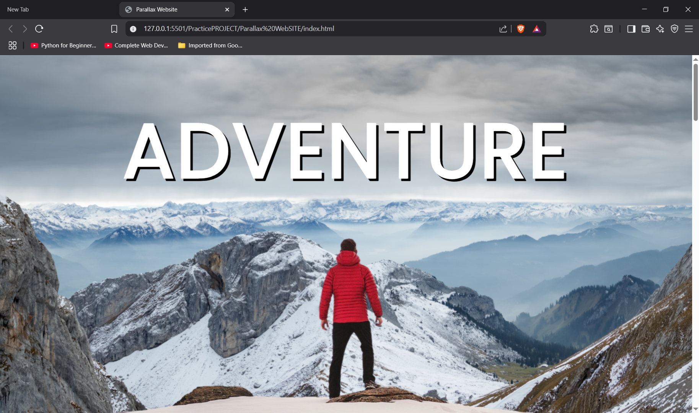

# 🌄 Parallax Scrolling Website

A mini project that showcases the parallax scrolling effect using pure **HTML** and **CSS**.

## 🚀 Live Demo
[Click Here to Visit the Site](https://hunnybunny14.github.io/parallax-website/)

## 🛠️ Tech Stack
- HTML
- CSS (3D perspective, transform, fixed backgrounds)

## 💡 Features
- Smooth parallax scrolling
- Sectioned layout with image overlays
- Fully responsive design
- Semantic, beginner-friendly structure

## 📸 Preview

 <!-- optional if you upload screenshot -->

## 📁 Project Structure
Parallax WebSITE/
│
├── index.html
├── style.css
├── background.png
├── foreground.png
├── sport-1.jpg
├── sport-2.jpg
├── sport-3.jpg
└── README.md

## 📌 Author
Made with ❤️ by **[@hunnyBunny14](https://github.com/hunnyBunny14)**
